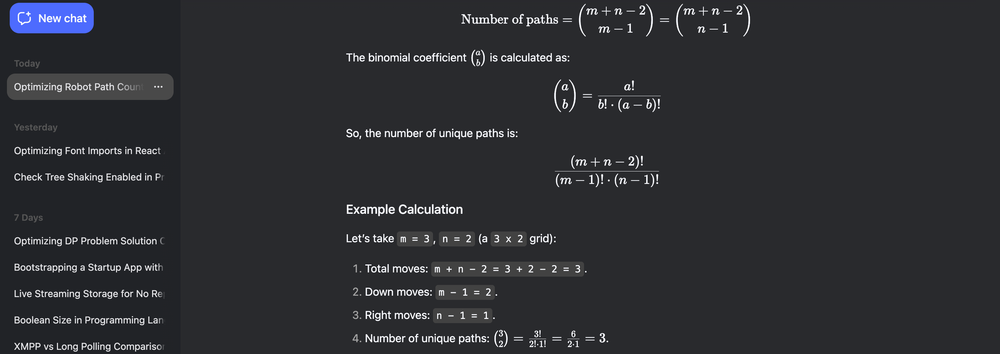

optimised way
Understanding the Problem
We have a robot on an m x n grid. The robot starts at the top-left corner (grid[0][0]) and wants to reach the bottom-right corner (grid[m-1][n-1]). The robot can only move right or down at any point in time. We need to find the number of unique paths the robot can take to reach the destination.

Breaking Down the Moves
Total Moves Required:

To go from the top-left to the bottom-right, the robot must move:

Down exactly (m - 1) times (since there are m rows, it needs to move down m - 1 times to reach the last row).

Right exactly (n - 1) times (since there are n columns, it needs to move right n - 1 times to reach the last column).

So, the total number of moves the robot makes is (m - 1) + (n - 1) = m + n - 2.

Sequence of Moves:

The robot's path is essentially a sequence of D (down) and R (right) moves.

For example, on a 2 x 3 grid (m = 2, n = 3), the robot must make 1 down and 2 right moves (m + n - 2 = 3 total moves).

Possible sequences: D R R, R D R, R R D.

So, there are 3 unique paths.

Combinatorics Approach
The problem reduces to: How many unique sequences can we form with (m - 1) Ds and (n - 1) Rs?

This is equivalent to choosing:

(m - 1) positions out of (m + n - 2) total positions to place the Ds (the rest will automatically be Rs), or

(n - 1) positions out of (m + n - 2) total positions to place the Rs (the rest will automatically be Ds).

This is given by the binomial coefficient (also called "combinations"):



Possible paths:

D D R

D R D

R D D

This matches our manual count.

To compute the binomial coefficient efficiently (without calculating large factorials directly):

```javascript
function uniquePaths(m, n) {
    let total = m + n - 2;      // Total moves
    let k = Math.min(m - 1, n - 1); // Choose the smaller to optimize
    let result = 1;
    
    for (let i = 1; i <= k; i++) {
        result = result * (total - k + i) / i;
    }
    
    return result;
}
```